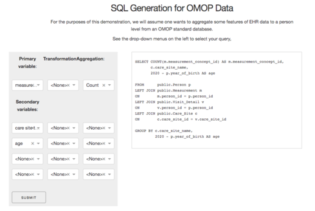

## PySQLGen

A stump of a project to generate (fairly straightforward) SQL for a given schema. This is a sketch of an effort that may be useful for the [DECOVID](https://www.decovid.org/) project, and is currently being tested on data following the [OMOP schema](https://ohdsi.github.io/TheBookOfOhdsi/CommonDataModel.html).

Currently support:

* Star schema data models.
* Automatic model traversal / JOIN conditions from selected fields.
* Auomatic joins to dimension tables (if reqd by user) to retrieve e.g. names instead of ids.
* Any number of depth-one subqueries (but no subqueries within subqueries etc.)
* Basic transformations.

Imminent support expected for:

* Custom table/CTE definitions (supplied by user)

Expected support for:

* Caching results to disk for use in a multi-user environment.

Known issues:

* JOINs will not necessarily follow the shortest path, as the code currently makes no use of constraints. That is a much more heavyweight implementation than I am intending. Hopefully the query optimizer should remove much of the pain here.
* No attempt is being made for optimality e.g. by refactoring queries to make optimal use of PKs etc.

